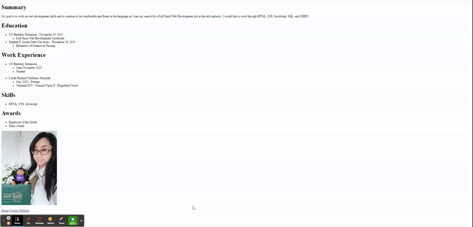

# Blossom

# Description

This repo is to help me review my skills that I have done in my coding Bootcamp by continuing to use the code. I'm finally getting time to go through the Angela Yu - Web Development Udemy courses that I purchased. It is surprising how much I understood compared to 6 months ago. I'm able to breeze through the assignments quickly. 

Previously, I was just deleting my repos as I practiced each section, but now I have decided to post them to give myself a visual aid and prove to my future self that one finished program always starts with the first clack of the keyboard somewhere.

## Table of Contents

## HTML 

### Main Folder

This folder is primarily utilizing the most basic skills of the hypertext markup language. We use headings, paragraph, hr, br, reference images, and anchor links. This looks like a webpage that is at the base level interactive and leads users to different sections of information.

### Capstone Resume

This section is a simple exercise in making an html built resume page. While, I have made a project in React a few weeks ago, I can still appreciate the simplicity and conciseness of content here. 

The point of the Capstone project is so that I can utilize knowledge from the lesson. There is no solution, so it is based off of my own creativity from the foundation of my knowledge. We were strictly to use HTML and nothing else.

## CSS

### Inline Internal External

Reviewing how to connect a stylesheet using three different methods. 

Inline is directly in the `<html>` Useful for targeting a single element.

Internal is when a `<style>` tag is inserted within the head. Useful for targeting a single page.

External is when a `<link>` relationship and href is placed within the head. This is the most commonly used to target a multi-page website.

### Selectors

